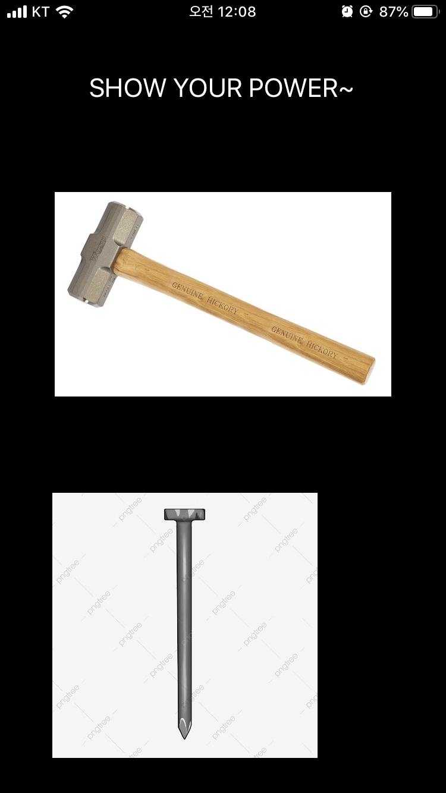

# Hammering

Developed by Changhyeon Park, at 무쓸모톤 on Nov. 3rd, 2019. 

### What is it?

폰을 흔들면, 못을 박는 ios 앱이다. 가속도 센서가 인식한 x, y 축의 값에 비례하여 못을 박는다. 

다만, 가속하는 반대 방향으로 못이 박힌다.

### Language

Swift

### Library

CoreMotion 

### Sample demo

